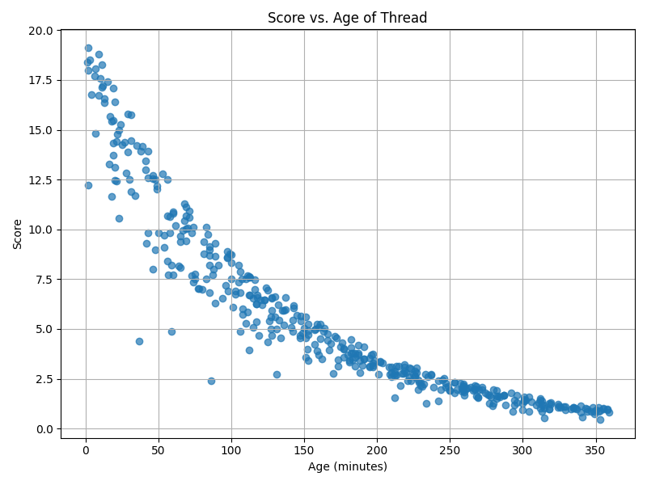
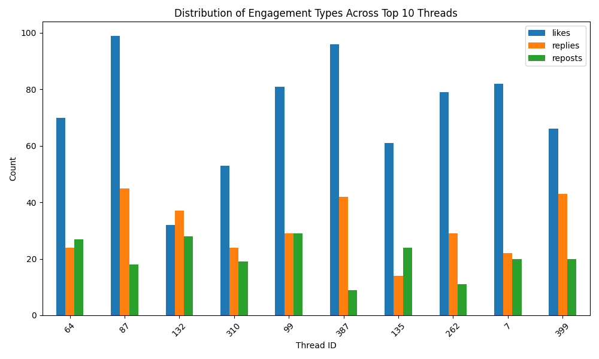
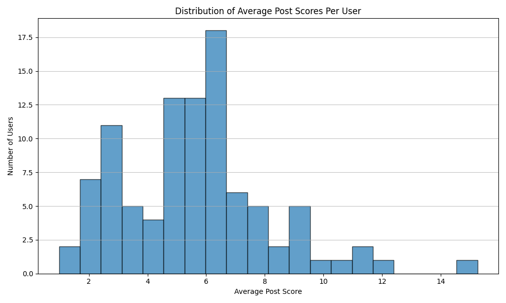

# threadscorer : A thread scoring engine for social media feeds

## Installation and setup
1. Clone the repository locally.
2. Create a virtual environment.
3. Run ```pip install -r requirements.txt``` within the environment.

## Files in the repository
```generate_threads.py``` : Generates a synthetic CSV dataset of threads with unique ID, number of likes, replies, reposts and age in minutes.

```score_threads.py``` : Computes an engagement score using vectorized calculations for each thread using the score formula, and appends it as a column to the existing CSV and creates a new scored CSV dataset.

```sort_threads.py``` : Sorts the scored CSV dataset based on the engagement score and extracts the top 10 threads along with metadata, and saves it in another CSV dataset.

## Score formula

```score = 2 * n_likes + 3 * n_replies + 2.5 * n_reposts * exp(-age_minutes / 120)```

This score formula gives highest weightage to replies, followed by reposts and lastly by likes. The weightage given to reposts is decayed exponentially based on the age of the post (in minutes). This ensures that the value of the engagement metrics is tempered by the age of the thread. 

An Alternate Scoring function is used to simulate diminishing returns.

alternate_score = $(\log_2(\text{likes} \times 2 + 1) + \log_2(\text{replies} \times 3 + 1) + \log_2(\text{reposts} \times 2.5 + 1)) \times e^{\frac{-\text{age\_minutes}}{\text{decay\_constant}}}$

## Running the threadscorer
1. To generate the dataset

```python3 generate_threads.py```

2. To score the dataset

```python3 score_threads.py```

3. To get the top 10 threads and their corresponding metadata

```python3 sort_threads.py```

## Results
From dataset generated using seed 42


Using Alternate Scoring function





