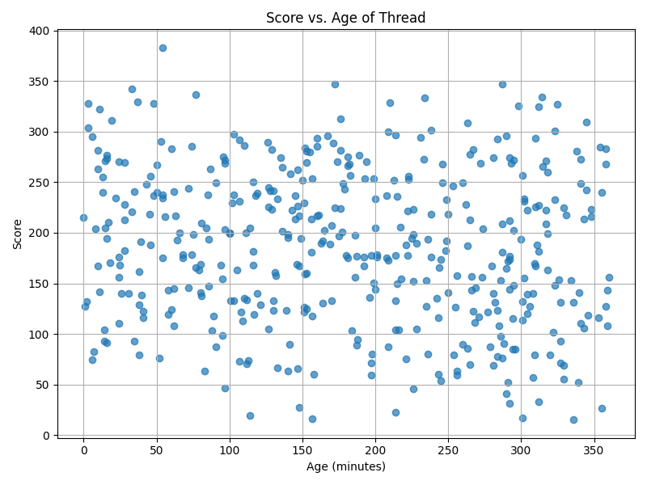
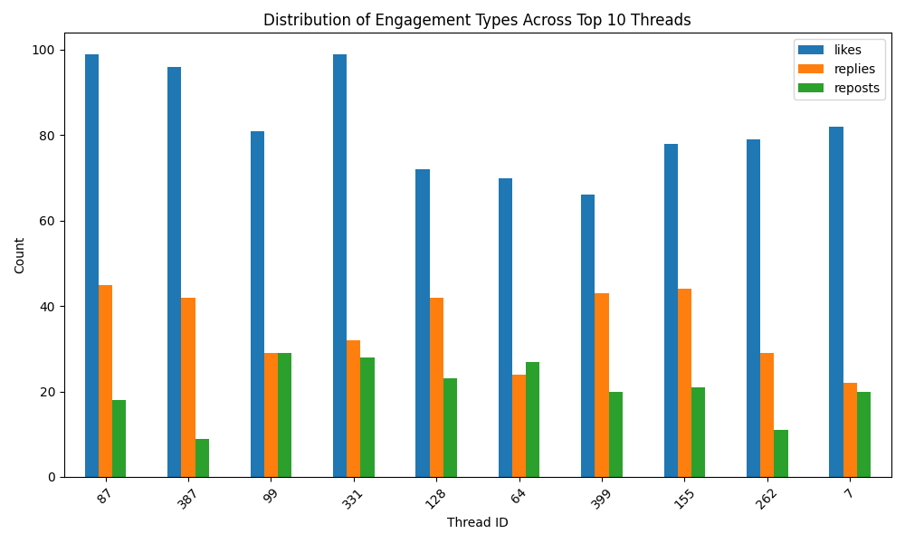

# threadscorer : A thread scoring engine for social media feeds

## Files in the repository
```generate_threads.py``` : Generates a synthetic CSV dataset of threads with unique ID, number of likes, replies, reposts and age in minutes.

```score_threads.py``` : Computes an engagement score using vectorized calculations for each thread using the score formula, and appends it as a column to the existing CSV and creates a new scored CSV dataset.

```sort_threads.py``` : Sorts the scored CSV dataset based on the engagement score and extracts the top 10 threads along with metadata, and saves it in another CSV dataset.

```plot_threads.py``` : Plots the score v age scatter plot of the dataset and the engagements of the top 10 threads.

## Score formula

```score = 2 * n_likes + 3 * n_replies + 2.5 * n_reposts * exp(-age_minutes / 120)```

This score formula gives highest weightage to replies, followed by reposts and lastly by likes. The weightage given to reposts is decayed exponentially based on the age of the post (in minutes). A decay constant of 120 is used, which means that the score of a post halves after around ```120 *ln(2)``` minutes, or approximately 83 minutes. This ensures that the value of the engagement metrics is tempered by the age of the thread.

## Installation and setup
1. Clone the repository locally and navigate to the directory.
```bash
git clone https://github.com/siddhantmohan1110/threadscorer.git
cd threadscorer
```

2. Create a virtual environment and activate it.
```bash 
python -m venv .venv
source .venv/bin/activate
```

3. Run within the environment.
```bash
pip install -r requirements.txt
``` 

## Running the threadscorer
1. To generate the dataset
```bash
python3 generate_threads.py
```

2. To score the dataset
```bash
python3 score_threads.py
```

3. To get the top 10 threads and their corresponding metadata
```bash
python3 sort_threads.py
```

4. To get the score v age scatter plot and the engagements of the top 10 threads.
```bash
python3 plot_threads.py
```

## Results
From dataset generated using seed 42



